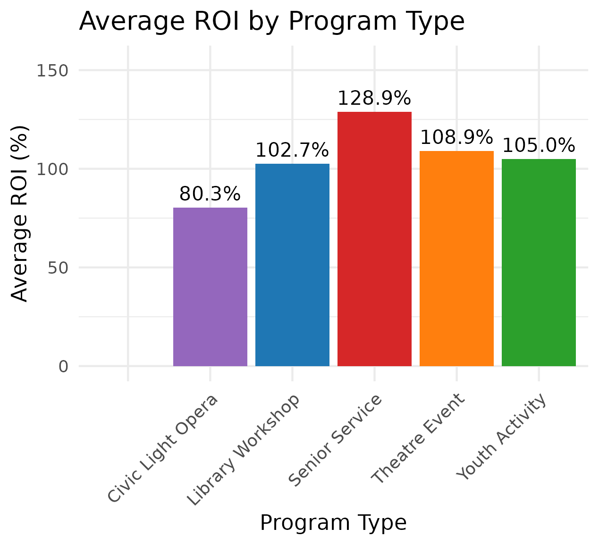
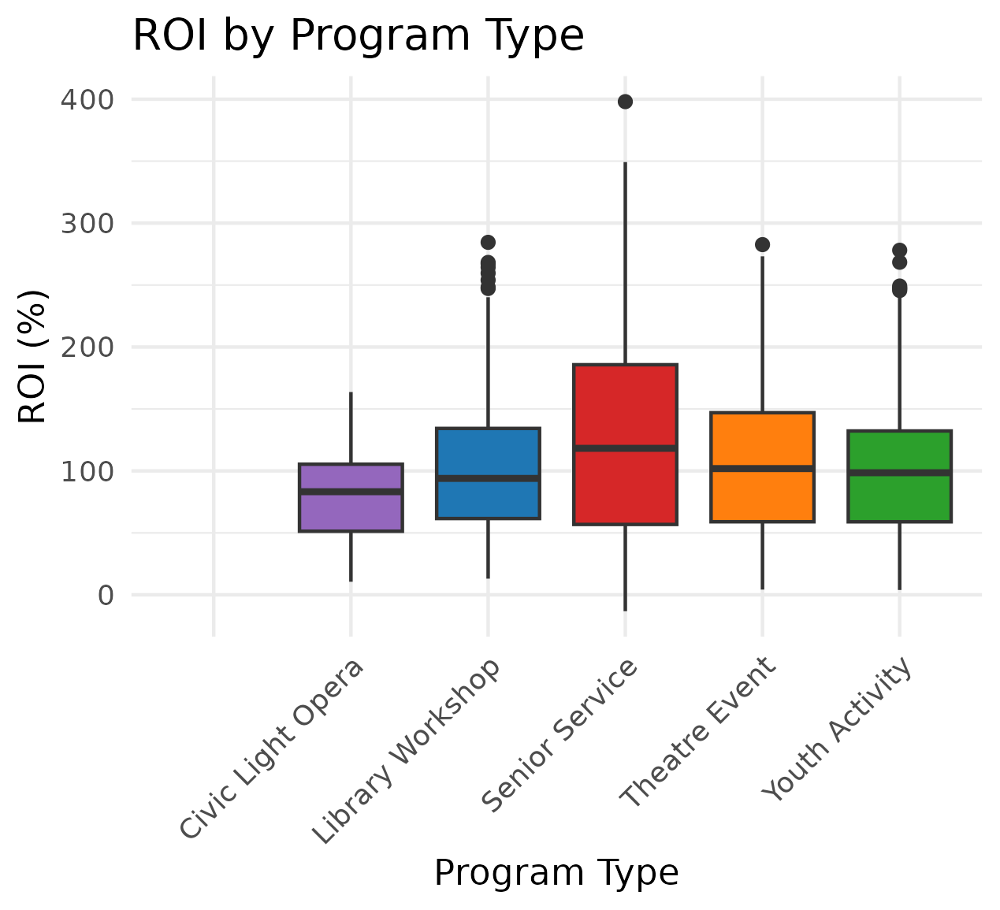
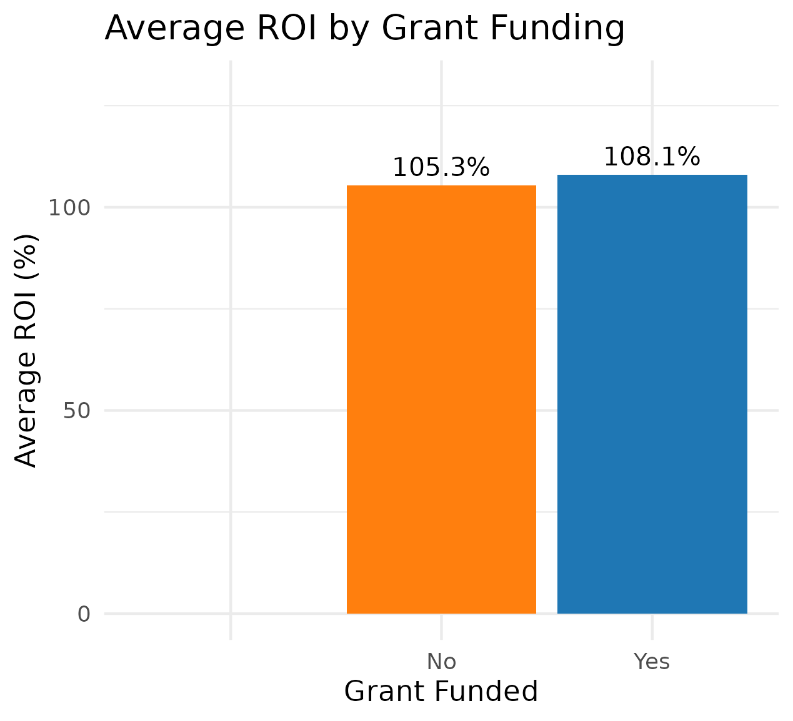

# Hundred Elms Community Services Impact Analysis


## Project Overview
This project analyzes participation and economic impact metrics for 1,000 hypothetical community programs in Hundred Elms, a fictional California town. Programs include library workshops, theatre events, youth activities, senior services, and Civic Light Opera performances. 

Using Python for data generation, Excel for data cleaning, Tableau Public (version 2024.3) for visualization, and R for statistical analysis, I created an interactive dashboard and ROI analysis to optimize resource allocation and support grant proposals. 

The analysis demonstrates skills in data management, dashboard creation, and community-focused insights, aligning with the Cultural and Community Services Analyst role.

## Data Sourcing
A synthetic dataset of 1,000 program records was generated in Python, simulating 12 months (July 2024–June 2025) of community programs in Hundred Elms. 

Fields include:

Program_ID

Program_Type (Library Workshop, Theatre Event, Youth Activity, Senior Service, Civic Light Opera)

Date (MM/DD/YYYY)

Attendance

Participant_Age_Group (Youth, Adult, Senior)

Satisfaction_Rating (1–5)

Program_Cost ($)

Location (e.g., Elmwood Library, Starlight Theatre)

Grant_Funded (Yes/No)

Economic_Impact ($)

## Data Cleaning in Excel
The dataset was cleaned in Excel:

Removed duplicates and incomplete entries.

Categorized programs by type and age group.

Calculated metrics: average attendance, satisfaction, cost per participant, economic impact per program.

Exported as community_programs_cleaned.csv.

// Example Pivot Table Setup

Rows: Program_Type

Columns: Participant_Age_Group

Values: Average Attendance, Average Satisfaction, Sum Economic_Impact

Filters: Grant_Funded

## Exploratory Data Analysis
In Excel, I conducted analysis:

Summarized attendance, satisfaction, and economic impact by program type and age group using pivot tables.

Identified correlations (e.g., attendance vs. economic impact) to highlight high-impact programs.

Flagged low-attendance programs for process improvement.

## Statistical Analysis with R
Using R, I performed statistical tests to validate findings:

Calculated ROI: (Economic_Impact - Program_Cost) / Program_Cost * 100.

Conducted t-tests to compare satisfaction and ROI across program types.

Generated visualizations: boxplot of ROI by program type, bar charts of average ROI by program type and grant funding, with all labels fully visible.

## Example: Calculate ROI and plot average ROI by Program_Type
```R
data <- read.csv("community_programs_cleaned.csv")
data <- data %>% mutate(ROI = (Economic_Impact - Program_Cost) / Program_Cost * 100)
roi_by_type <- data %>% group_by(Program_Type) %>% summarise(Avg_ROI = mean(ROI, na.rm = TRUE))
ggplot(roi_by_type, aes(x = Program_Type, y = Avg_ROI, fill = Program_Type)) +
  geom_bar(stat = "identity") +
  scale_fill_manual(values = c("Library Workshop" = "#1f77b4", 
                               "Theatre Event" = "#ff7f0e", 
                               "Youth Activity" = "#2ca02c", 
                               "Senior Service" = "#d62728", 
                               "Civic Light Opera" = "#9467bd")) +
  labs(title = "Average ROI by Program Type", x = "Program Type", y = "Average ROI (%)") +
  theme_minimal() +
  theme(axis.text.x = element_text(angle = 45, hjust = 1), legend.position = "none") +
  geom_text(aes(label = sprintf("%.1f%%", Avg_ROI)), vjust = -0.5, size = 3.5) +
  coord_cartesian(ylim = c(0, max(roi_by_type$Avg_ROI, na.rm = TRUE) * 1.2))
```


*Bar chart showing average ROI for each program type, with Senior Service (128.9%) fully labeled, highlighting high-impact programs like Civic Light Opera.*



*Boxplot showing ROI distribution by program type, identifying variability and outliers.*



*Bar chart comparing average ROI for grant-funded vs. non-grant-funded programs, with all labels fully visible.*

## Dashboard Development in Tableau Public
I built a dashboard (1280 x 1024 pixels) in Tableau Public, featuring:

Bar Chart: Attendance by program type (400 x 300 pixels).

Line Chart: Satisfaction ratings over time (400 x 300 pixels).

Pie Chart: Program distribution by age group (300 x 300 pixels).

Map: Program locations in Hundred Elms (400 x 300 pixels, using Tableau’s built-in maps).

Bar Chart: Economic impact by program type (400 x 300 pixels).

Filters: Program type, age group, grant-funded status.

The dashboard is published at Tableau Public Dashboard.

Interactive dashboard visualizing participation and economic impact metrics for Hundred Elms community programs, with charts and filters for program type and age group.

## Key Insights

Library workshops and Civic Light Opera programs lead in attendance; senior services have high satisfaction (mean ~4.7/5) and ROI (128.9%) but lower turnout.

Civic Light Opera generates the highest economic impact (mean ~$6,000 per event) and strong ROI, due to ticket sales.

Grant-funded programs attract more participants but require cost optimization.

Theatre events show moderate engagement and ROI, ideal for cross-promotion with Civic Light Opera.

## Recommendations

Resource Allocation: Prioritize funding for library workshops and Civic Light Opera due to high attendance, ROI, and economic impact.

Process Improvement: Increase outreach for senior services to boost attendance despite high ROI.

Grant Proposals: Highlight Civic Light Opera and senior services in grant applications for their economic contributions.

Cross-Division Collaboration: Pair theatre events with Civic Light Opera to enhance participation.

Efficiency: Consolidate low-attendance programs using lean principles.

## Skills Demonstrated

Data generation and scripting (Python)

Data cleaning and transformation (Excel)

Dashboard creation and visualization (Tableau Public)

Statistical analysis and ROI calculation (R)

Data-driven storytelling for community and economic impact

Organizational and analytical skills for process improvement
